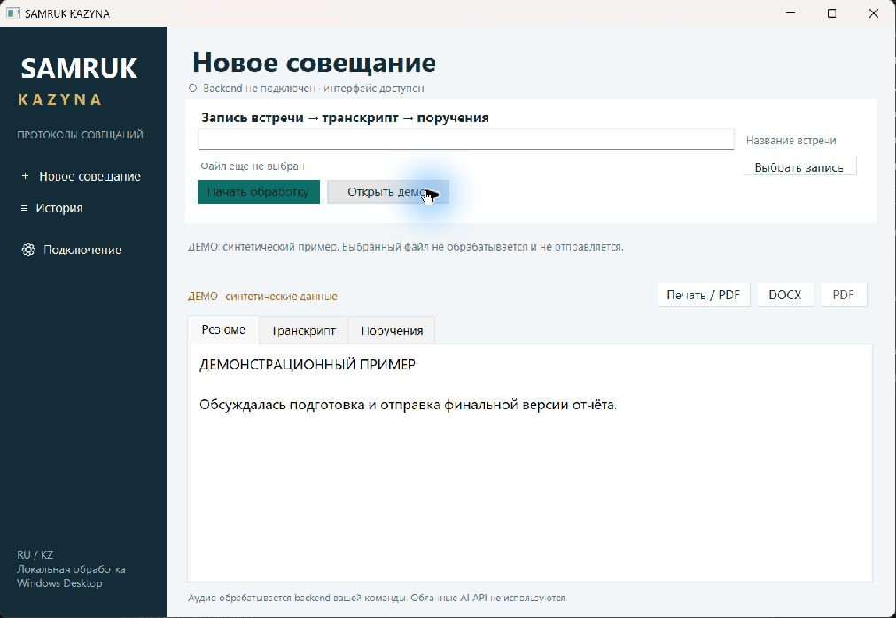
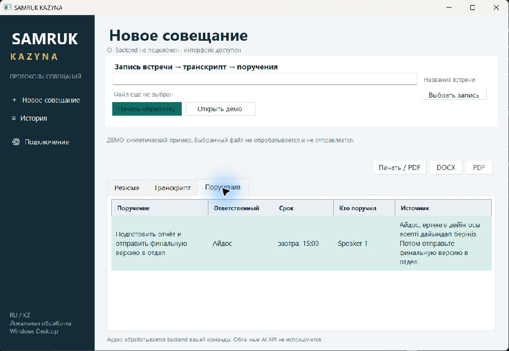

# SAMRUK KAZYNA

**Из записи совещания — в проверяемый протокол и поручения.**

Проект команды **404-team-not-found** для HackAlem: локальное протоколирование
совещаний на русском, казахском и смешанном языке. Основной клиент — Windows EXE
на C# / Windows Forms. AI-модели и Python backend размещаются на компьютере
пользователя или сервере в его локальной сети.

**Статус:** Windows EXE и backend соединены по целевому API. Реализованы загрузка,
последовательная очередь моделей, SQLite, объединение timestamps и DOCX/PDF.
Связка настоящего native-клиента с настоящим FastAPI прошла 10/10 проверок
с синтетическими моделями. Финальный прогон всей системы на реальной записи
и GPU компьютера Local AI ещё требуется.

[Проверка для жюри](docs/jury-guide.md) · [Архитектура](docs/architecture.md) ·
[Результаты и воспроизведение проверок](docs/verification.md) · [Все документы](docs/README.md)

**[Состояние проекта перед сдачей](docs/submission-status.md)** — что передано,
какие проверки выполнены и что ещё требует подтверждения.

## Проблема и польза

Секретари, руководители проектов и производственные команды вручную переносят
решения встреч в протоколы. В длинной записи легко потерять поручение,
перепутать ответственного или срок. Для русско-казахских совещаний дополнительно
важно сохранить исходный язык реплик и технические термины.

Целевой результат системы:

- транскрипт с временными метками и анонимными говорящими;
- краткое резюме;
- поручения: суть, ответственный, срок, автор и цитата-источник;
- DOCX/PDF для проверки и передачи команде.

Человек сверяет результат с записью. Если имя или срок неизвестны, система
должна оставить их неизвестными. Цитата и говорящий помогают проверить основание
поручения. Ожидаемая польза — меньше ручного переноса текста и пропущенных решений;
экономия времени и качество на представительной выборке пока не измерены.

## Что работает сейчас

| Часть | Реализовано | Граница готовности |
| --- | --- | --- |
| Windows-клиент | Выбор записи, настройки сервера, история/API-клиент, просмотр результата | 10/10 проверок EXE → настоящий FastAPI/SQLite/worker/export с синтетическими моделями; реальный GPU-прогон впереди |
| Явное демо | RU/KK-транскрипт, резюме, поручения и локальный DOCX | Синтетические данные; выбранная запись не обрабатывается |
| Backend | FastAPI, загрузка, один worker, SQLite, нормализация WAV, статусы, результат и экспорт | 22 backend-проверки; реальная запись на ПК Local AI ещё требуется |
| Local AI | Whisper, Community-1, Qwen3/Ollama, проверка источников; адаптеры подключены к worker | Реальные модели проверялись отдельно, интегрированный GPU-прогон пока не выполнен |
| PDF | Серверный PDF через ReportLab, запрос из EXE, системная печать демо | Серверный экспорт проверен на синтетическом результате; системная печать демо не проверена |
| Прежний UI | Streamlit-прототип сохранён в `frontend/` | Отдельный стек и прежний API; не входит в основной EXE |

Поручения в нативном клиенте доступны **только для просмотра**. Редактирование,
дашборд статусов, присоединение к Teams/Zoom/Meet и напоминания не входят в
работающий сценарий текущего EXE. Подробности — [план развития](ROADMAP.md).

## Быстрый запуск: Windows-клиент и демо

Нужны Git, доступ к репозиторию, Windows и .NET Framework 4.8+.
Сборочный скрипт использует системный `csc.exe`; если компилятор отсутствует,
он сообщает о необходимости .NET Framework Developer Pack.

```powershell
git clone https://github.com/BAITC-Hacks/hack-c5aa2345-404-team-not-found.git
cd hack-c5aa2345-404-team-not-found
.\desktop\build-native.ps1
.\desktop\release\SAMRUK-KAZYNA.exe
```

Если репозиторий уже получен, выполняйте последние две команды из его корня.
В окне приложения нажмите **«Открыть демо»**, просмотрите резюме, транскрипт и
поручения, затем сохраните **DOCX**. Backend и модели для этого не нужны.

Клиент не требует Python, Node.js, браузера или WebView2. .NET Framework является
системной зависимостью. Отдельный сервер Python и модели в EXE не входят.
Файл EXE не хранится в Git, опубликованного Release пока нет: на новом клоне
`desktop/release/` появится после сборки. Полученный SHA-256:

```powershell
Get-FileHash .\desktop\release\SAMRUK-KAZYNA.exe -Algorithm SHA256
```

Сборка не подписана. Ранее она запускалась на Windows 11 / .NET Framework 4.8.1;
чистый второй ПК ещё не проверен. [Подробная инструкция клиента](docs/desktop/README.md)
и [отчёт с параметрами проверенного артефакта](docs/desktop/handoff.md).

## Запуск текущего backend

На готовом ПК Local AI используйте существующее окружение с моделями и работающей
Ollama. Полная [инструкция запуска](docs/backend-launch.md) описывает безопасное
обновление main, диагностику и LAN. Из корня свежего checkout:

```powershell
. .\scripts\local-ai\ai-env.ps1 -VenvPath 'C:\Users\Amankos\Downloads\Hakaton\.venv'
& $env:HACKALEM_PYTHON -m pip install -r .\backend\requirements-runtime.txt
& $env:HACKALEM_PYTHON -m pip check
.\scripts\start-backend.ps1 -VenvPath 'C:\Users\Amankos\Downloads\Hakaton\.venv'
```

Скрипт запускает один worker без access logs. Модели, Torch и CUDA повторно
не устанавливайте: runtime-файл содержит только лёгкие зависимости API/экспорта.
Оставьте терминал работающим. Во втором терминале:

```powershell
Invoke-RestMethod http://127.0.0.1:8000/health | ConvertTo-Json -Depth 6
.\desktop\build-native.ps1
.\desktop\release\SAMRUK-KAZYNA.exe
```

Ожидается `status: "ok"`, `local_only: true` и модули `ready`. Без локальных
ресурсов health возвращает `not_ready`, загрузка — 503. Изучите
`processing_modules`; health проверяет ресурсы и Ollama, но не выполняет inference.
Swagger: <http://127.0.0.1:8000/docs>. Остановка сервера — Ctrl+C.

В EXE задайте `http://127.0.0.1:8000` для того же ПК. Для другого ПК запустите
скрипт с `-BindAddress <LAN-IP-сервера>` и используйте этот адрес в клиенте.
Без моделей на новом ПК можно установить `backend/requirements-runtime.txt`
в Python 3.11 venv и запустить `uvicorn app.main:app --app-dir backend
--host 127.0.0.1 --port 8000 --workers 1`; health будет `not_ready`.

Настройки читаются из переменных окружения, `.env` автоматически не загружается.
Корневой `requirements.txt` относится к прежнему Streamlit-стеку. Приватное
хранилище по умолчанию — `%LOCALAPPDATA%/SAMRUK_KAZYNA/meetings`.

## Локальные модели

[Local AI: установка и воспроизведение](docs/local-ai/README.md) — отдельная
инструкция для серверного ПК. Она описывает окружение, веса, FFmpeg,
Ollama и прямые проверки адаптеров. Первичная установка и скачивание моделей
требуют сети; последующая обработка должна выполняться локально.

По [отчёту Local AI](docs/local-ai/handoff.md) модели запускались на ПК участника,
в том числе на 90-секундном фрагменте при блокировании внешних Python-соединений.
Это не проверка всего приложения без интернета. WER/DER и точность извлечения
поручений на эталонной выборке пока не установлены.

Обновлённый отчёт содержит отдельный прогон полной записи **274,25 с**:
STT — **41,48 с**, диаризация — **16,09 с**, анализ Ollama — **18,84 с**,
получено 7 поручений. Это времена отдельных этапов, не время полного сценария.
Для диаризации потребовалось преобразование MP3 в mono PCM16 WAV 16 kHz;
новый backend делает эту подготовку и передаёт один WAV обоим адаптерам.
Эту интеграцию ещё нужно проверить на GPU; ручная проверка качества не завершена.
Новый CLI `scripts/local-ai/evaluate-meeting.py` воспроизводит этапы диагностики,
но его новая версия целиком на реальной записи ещё не запускалась.

## Технологии и устройство

| Компонент | Технологии | Роль |
| --- | --- | --- |
| Основной клиент | C# 5, WinForms, .NET Framework 4.8+, HttpClient | Один EXE, формы, HTTP-клиент, локальный демо-DOCX |
| API | Python, FastAPI, Pydantic, Uvicorn | Загрузка, статусы, очередь и схемы |
| STT | faster-whisper 1.2.1 / Whisper large-v3 | Текст на исходном языке и timestamps |
| Диаризация | pyannote.audio 4.0.7 / Community-1 | Анонимные интервалы говорящих |
| Анализ | Qwen3:4b через локальный Ollama | Резюме и поручения с проверкой источников |
| Аудиосреда | FFmpeg, Torch/TorchCodec | Декодирование и runtime моделей |
| Хранение и экспорт | SQLite, python-docx, ReportLab | История, результаты и серверный DOCX/PDF |

AI используется как последовательность специализированных этапов.
Самостоятельного агента, который подключается к встречам или выполняет поручения,
в текущем коде нет. [Схема модулей и потока данных](docs/architecture.md).

## Как оценить решение

1. Пройдите [сценарий жюри](docs/jury-guide.md): демо EXE, DOCX, состояние backend.
2. Сопоставьте показанное с [API-контрактом](docs/api-contract.md) и исходниками.
3. При необходимости воспроизведите отдельные [проверки компонентов](docs/verification.md).
4. Для AI подготовьте согласованную запись и эталон, следуя инструкции Local AI.
5. На ПК Local AI выполните оставшийся реальный прогон: EXE → загрузка →
   completed → проверка RU/KK-текста и поручений → DOCX/PDF. При failed сохраните
   безопасный текст ошибки, не подменяйте результат демо.

Подтверждённые результаты: **22 backend-теста**, **43 автономных AI-теста**
(29 адаптеров + 14 диагностики), **10 native EXE → настоящий API проверок**
с синтетическими моделями и отдельно **21 native-проверка** с тестовым сервером.
GUI и реальные модели описаны в handoff. Эти числа не измеряют качество речи.
Реальный GPU-прогон всей системы ещё не подтверждён.

## Скриншоты

Снимки настоящего окна клиента; показанные данные синтетические.





[Транскрипт RU/KK](docs/screenshots/native-demo-transcript.png) ·
[Настройки подключения](docs/screenshots/native-settings.png)

## Навигация по репозиторию

```text
desktop/native/           основной Windows-клиент
desktop/build-native.ps1  сборка EXE и SHA-256
backend/app/             API, очередь, SQLite, AI-адаптеры и экспорт
backend/tests/           backend и native→API проверки
backend/tests/local_ai/  автономные проверки адаптеров
scripts/start-backend.ps1 запуск в готовом AI-окружении
scripts/local-ai/        диагностика и прямой запуск локальных моделей
samples/                 синтетические JSON-примеры
frontend/                сохранённый Streamlit-прототип
docs/                    инструкции, архитектура, отчёты, сценарий жюри
```

[Команда и зоны ответственности](docs/team-workflow.md) · [Roadmap](ROADMAP.md) ·
[Критерии сдачи](docs/hackathon-checklist.md).
Модели, записи, транскрипты пользователей, окружения, EXE и секреты исключены из Git.
Доступ к закрытому репозиторию и передача собранного EXE жюри организуются командой.
