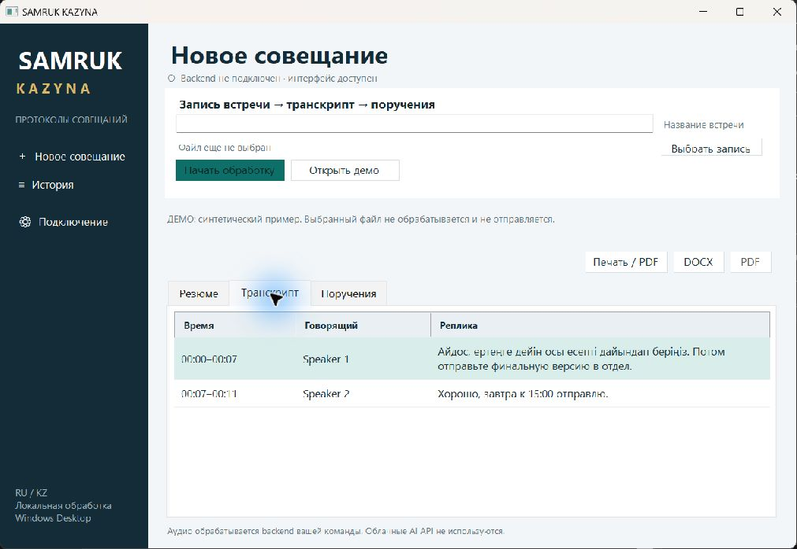
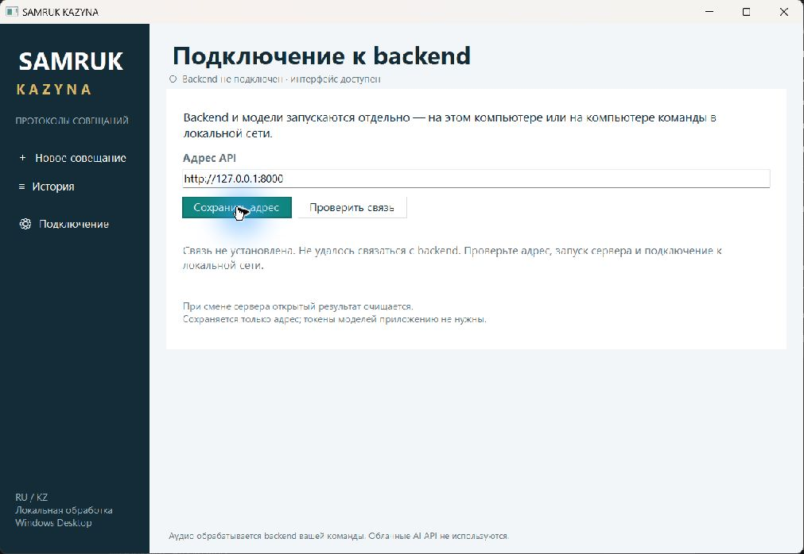

# SAMRUK KAZYNA

Локальная система протоколирования совещаний на русском, казахском и смешанном русско-казахском языке. Проект команды **404-team-not-found** для HackAlem.

## Какую проблему решаем

Секретари вручную составляют протоколы встреч: это занимает время, а поручения, сроки и ответственные могут потеряться. SAMRUK KAZYNA должен преобразовывать запись в проверяемый транскрипт с говорящими, краткое резюме и поручения с источниками. Неизвестные имена и сроки система не должна выдумывать.

**Целевой сценарий:** пользователь открывает Windows EXE, выбирает аудио/видео, получает результат локальной обработки, проверяет выводы и сохраняет DOCX/PDF.

## Текущий статус

**Windows EXE и backend соединены по API. Реализованы загрузка, последовательная очередь моделей, SQLite, статусы, транскрипт, поручения и DOCX/PDF. Связка настоящего клиента EXE с настоящим FastAPI прошла 10/10 проверок с синтетическими моделями. Финальный прогон на реальной записи и GPU компьютера Local AI ещё требуется.**

| Часть | Что есть сейчас | Следующий шаг |
| --- | --- | --- |
| Backend | FastAPI, загрузка, SQLite, один worker, WAV, адаптеры и DOCX/PDF | реальная запись на ПК Local AI |
| Local AI | Whisper / Community-1 / Qwen3, [проверки моделей на ПК участника](docs/local-ai/handoff.md) | финальная проверка через EXE/backend |
| Windows EXE | один собранный файл, запуск собственного окна, RU/KK-демо, просмотр поручений, локальный DOCX | проверка на другом Windows-ПК и с настоящим backend |
| API клиента | 10/10 проверок клиента из EXE с реальными маршрутами, worker, SQLite и экспортом | повтор на реальных моделях вместо тестовых |
| Предыдущий UI | Streamlit сохранён в `frontend/`, включён в main через `7f341e8` | доступен отдельно как прежний прототип; не входит в native EXE |

Все маршруты [API](docs/api-contract.md) реализованы. Health возвращает `ok`, если найдены локальные модели, пакеты, FFmpeg, шрифт PDF и доступна локальная Ollama; иначе `not_ready`, загрузка — 503. Health не загружает модели и не доказывает качество распознавания. **Быстрый запуск на готовом компьютере друга: [инструкция backend](docs/backend-launch.md).**

## Windows EXE: сборка и запуск

Выбран один самостоятельный клиентский файл:

```text
desktop/release/SAMRUK-KAZYNA.exe
```

На Windows с системным **.NET Framework 4.8 или новее** из корня репозитория:

```powershell
.\desktop\build-native.ps1
.\desktop\release\SAMRUK-KAZYNA.exe
```

Сборка использует системный C#-компилятор `csc` и Windows Forms. Приложение запущено на **Windows 11, build 22631, .NET Framework 4.8.1 (Release 533320)**. Python, Node.js, браузер, WebView2 и папка `_internal` для клиента не нужны. На другом ПК проверка пока не выполнялась; там может потребоваться установка .NET Framework.

Команда `.\desktop\build.ps1` также запускает эту native-сборку. Прежний эксперимент сохранён под именем `desktop/build-webview-experiment.ps1`; в `desktop/release/` находятся только native EXE и его хеш.

Размер текущего EXE — **88 064 байта**. SHA-256:

```text
07484cbd2202608f870c2ee782a623af579f2732ec68ec7b54a231ab04ecee57
```

Хеш также записан в `desktop/release/SAMRUK-KAZYNA.exe.sha256`. EXE не подписан. Инструкции и пределы проверки: [Desktop README](docs/desktop/README.md), [handoff](docs/desktop/handoff.md). Прежние эксперименты `pywebview`/PyInstaller сохранены и не входят в этот EXE.

## Backend и модели

Клиентский EXE не содержит Whisper, pyannote, Ollama или серверный Python. Backend и модели запускаются отдельно: на этом же ПК либо на компьютере участника Local AI в локальной сети.

- На том же ПК: `http://127.0.0.1:8000`.
- На другом ПК: согласованный LAN-адрес сервера, который пользователь задаёт в настройках клиента.
- Ollama остаётся на loopback серверного ПК; клиент обращается только к backend.

Аудио, транскрипты и результаты не передаются в облачные AI API. На ПК Local AI загрузка Community-1, распознавание и разделение говорящих для 90-секундного фрагмента уже проверены при запрете внешних Python-соединений. Полный сценарий EXE → backend → модели при отключённом интернете пока не проверен.

В `main` включены Desktop `46d7f09` и Local AI с обновлением `408d349`, история сохранена. Модели остаются на компьютере участника; команды, версии, параметры конструкторов и ограничения описаны в [Local AI handoff](docs/local-ai/handoff.md).

В handoff зафиксирован отдельный прогон полной записи **274,25 с** на ПК Local AI: STT — **41,48 с**, diarization — **16,09 с**, анализ Ollama — **18,84 с**, получено 7 поручений. Это времена отдельных этапов, не измерение полного сценария. Для diarization исходный MP3 пришлось преобразовать в mono PCM16 WAV 16 kHz; новый backend выполняет эту подготовку и подаёт один WAV обоим адаптерам, что ещё нужно проверить на его GPU. Неизвестные авторы остались `null`. Сравнение с отредактированным PDF не является измерением точности распознавания, ручная проверка качества не завершена.

Добавлен диагностический CLI `scripts/local-ai/evaluate-meeting.py` и инструкция воспроизведения. Его новая версия проверена автономными тестами, но ещё не прогонялась целиком на реальной записи. Это отдельная диагностика; финальный показ выполняется через новый backend и EXE.

## Технологии

| Слой | Технологии | Назначение |
| --- | --- | --- |
| Windows-клиент | C# 5, Windows Forms, .NET Framework 4.8+ | нативное окно и единый EXE |
| Backend | Python 3.11, FastAPI, Pydantic, Uvicorn | API, проверка данных, последовательная очередь |
| Подготовка аудио | FFmpeg | локальный mono PCM16 WAV, 16 kHz |
| Распознавание | faster-whisper 1.2.1, Whisper large-v3 | адаптер локального текста и временных меток |
| Говорящие | pyannote.audio 4.0.7, Community-1 | адаптер локального разделения по говорящим |
| Анализ | Qwen3:4b через Ollama | адаптер резюме и поручений |
| Хранение и экспорт | SQLite, python-docx, ReportLab | встречи, DOCX/PDF с RU/KK Unicode |
| Сохранённый прототип | Streamlit, Python | прежний UI в `frontend/`, отдельный деморежим |

Параметры моделей и проверенные версии зафиксированы в [Local AI handoff](docs/local-ai/handoff.md) и `backend/requirements-ai.txt`. В native EXE автономный демопротокол можно сохранить в DOCX. Для реального результата DOCX/PDF запрашиваются у backend; автономный PDF предусмотрен через системную печать в PDF при наличии соответствующего принтера, но печать пока не проверена. Таблица поручений доступна только для просмотра: редактирование и сохранение задач не реализованы, метода для них нет в текущем API-контракте.

## Быстрый запуск на готовом компьютере Local AI

Модели и Ollama уже установлены на ПК участника. Из корня свежего checkout команды:

```powershell
. .\scripts\local-ai\ai-env.ps1 -VenvPath 'C:\Users\Amankos\Downloads\Hakaton\.venv'
& $env:HACKALEM_PYTHON -m pip install -r .\backend\requirements-runtime.txt
& $env:HACKALEM_PYTHON -m pip check
.\scripts\start-backend.ps1 -VenvPath 'C:\Users\Amankos\Downloads\Hakaton\.venv'
```

Во втором окне из корня репозитория:

```powershell
Invoke-RestMethod http://127.0.0.1:8000/health | ConvertTo-Json -Depth 4
.\desktop\build-native.ps1
.\desktop\release\SAMRUK-KAZYNA.exe
```

Выберите запись в EXE при `status=ok`, дождитесь результата, сохраните DOCX и PDF. Для клиента на другом компьютере передайте `-BindAddress` с LAN-IP серверу и задайте этот адрес в EXE. Полная [инструкция запуска](docs/backend-launch.md) включает обновление Git без потери работы и диагностику. Не переустанавливайте AI-окружение ради запуска API.

Для нового компьютера сначала подготовьте модели по [Local AI handoff](docs/local-ai/handoff.md). Без моделей можно установить `backend/requirements-runtime.txt` и запустить `python -m uvicorn app.main:app --app-dir backend --host 127.0.0.1 --port 8000 --workers 1`: сервер покажет `not_ready`. Автоматических загрузок моделей и подмены результата демоданными нет.

## Что проверить жюри

1. Health: `ok`, `local_only=true`, модули `ready`; при отсутствующих моделях — `not_ready`.
2. Загрузка согласованной WAV/MP3/M4A/MP4 через EXE: состояния queued → processing → completed либо понятная ошибка.
3. Резюме, временные метки, анонимные говорящие и поручения с источниками. Сверьте их с записью.
4. DOCX/PDF: откройте оба документа, проверьте русский/казахский текст и сроки.
5. История встреч сохраняется после перезапуска. Прерванная обработка получает failed, запись можно загрузить заново.
6. Отдельный явный деморежим EXE использует [синтетический JSON](samples/api/meeting-completed.json) и не обрабатывает запись.

Лимиты MVP: 250 МБ, до 60 минут, очередь из 5 ожидающих встреч, один процесс backend. Исходники и результаты сохраняются в `%LOCALAPPDATA%/SAMRUK_KAZYNA/meetings` вне Git; автоматического удаления пока нет. Конфигурация — переменные окружения; `.env` автоматически не читается. API предназначен для локального компьютера/согласованной LAN; аутентификация и публичное размещение не реализованы.

Неоднозначные говорящие отмечаются `UNRESOLVED`; их авторы не назначаются. Длинный текст делится по целым репликам до 4500 символов, резюме выводится по частям; имя автора между частями автоматически не переносится. Слишком длинная одиночная реплика вызывает явную ошибку, текст не обрезается. Ограничения контекста и качество длинных встреч ещё требуют реальных измерений.

## Выполненные проверки

Backend: **22/22** теста API/очереди/объединения/лимитов и **43/43** автономных AI-теста; отдельно **10/10** проверок настоящего клиента из EXE с настоящим FastAPI и синтетическими моделями. DOCX разобран как XML, PDF проверен извлечением RU/KK-текста и просмотром страницы. Настоящие модели здесь не запускались.

Для финального native EXE с указанным SHA прошли **21/21** проверки `desktop/tests/run-native-checks.py`: URL, встроенный демопример, корректный DOCX, целевые API-запросы, ошибки, отмена и запрет перенаправления загрузки. Использовался локальный тестовый сервер, а не AI-backend. В GUI отдельно проверены запуск, RU/KK-демо, выбор `synthetic.wav`, сохранение DOCX, сохранение адреса backend, сообщение о недоступном сервере и закрытие с завершением процесса. Копия одного EXE также запущена из отдельной папки с временной рабочей директорией. Подробности — [Desktop handoff](docs/desktop/handoff.md).

После включения `408d349` на ПК Medet повторно прошли **43/43 автономных AI-теста** (моки и синтетические данные), проверка схемы backend, компиляция новых Python-файлов, CLI `--help`, `git diff --check` и `pip check` тестового окружения Python 3.12.14 с Pydantic 2.10.5, httpx 0.28.1 и soundfile 0.13.1. Модели на этом ПК не запускались. Команда из папки `backend/`: `python -m unittest discover -s tests/local_ai -v`.

На ПК Local AI реальные модели проверены отдельно; точность слов, соответствие анонимных меток людям и качество mixed ru/kk ещё не подтверждены эталоном. У сохранённого Streamlit UI ранее прошли 14 тестов; это отдельный результат, не часть 21 native-проверки. Реальный прогон EXE → backend → модели на GPU пока не подтверждён.

## Финальная проверка на реальных моделях

Это оставшаяся совместная проверка; синтетические тесты не заменяют её:

1. На ПК с уже готовыми моделями запустить backend по docs/backend-launch.md.
2. Открыть native EXE, указать адрес backend и проверить подключение.
3. Выбрать согласованную запись с двумя говорящими и русско-казахской речью.
4. Дождаться обработки; сверить исходные слова, говорящих и временные метки.
5. Проверить поручения, ответственных, сроки и цитаты. Неизвестные данные должны оставаться неизвестными.
6. Сохранить DOCX/PDF и проверить содержание.
7. Повторить после отключения внешнего интернета, сохранив доступ к LAN-backend.

Для измерений нужны запись с согласием участников и эталонная расшифровка. Время обработки, память и ограничения смешанной речи фиксируются в отчёте. Требования организаторов: [чек-лист сдачи](docs/hackathon-checklist.md).

## Артефакт и скриншоты

Локальный артефакт: `desktop/release/SAMRUK-KAZYNA.exe`; размер и SHA-256 указаны выше. Публикация Release пока не выполнялась и согласуется отдельно. Бинарные файлы, модели, токены и записи в Git не добавляются.

Реальные снимки запущенного native EXE с синтетическими данными:







## Команда и структура

| Роль | Ветка | Ответственность |
| --- | --- | --- |
| Medet — backend | `codex/backend` | API, очередь, хранение, экспорт, интеграция и общий README |
| Local AI | `codex/local-ai-setup` | модели, окружение, проверки и адаптеры |
| Windows Desktop | `codex/desktop-app` | native UI/API-клиент, EXE и скриншоты |

```text
backend/                 # Python API, очередь, SQLite, адаптеры и экспорт
desktop/native/          # основной C# / WinForms-клиент
desktop/build-native.ps1 # основная сборка одного EXE
frontend/                # сохранённый прежний Streamlit-прототип
samples/                 # синтетические примеры
docs/                    # архитектура, API, роли, инструкции
scripts/                 # setup-скрипты Local AI
AGENTS.md                # правила работы команды
```

Начните с [AGENTS.md](AGENTS.md), [архитектуры](docs/architecture.md), [правил работы](docs/team-workflow.md) и [промпта роли](docs/team-prompts.md). План — [ROADMAP.md](ROADMAP.md). Основную ветку объединяет координатор после проверки совместимости.
