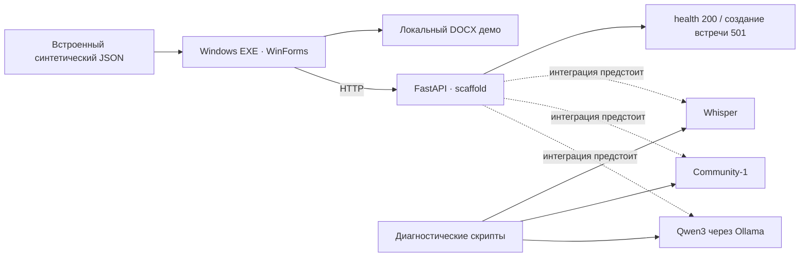

# Архитектура SAMRUK KAZYNA

## Компоненты текущего main

Основной клиент — C# 5 / WinForms, собираемый в один EXE на системном
.NET Framework 4.8+. Streamlit и pywebview/PyInstaller сохранены как предыдущие
эксперименты и не запускаются нативным клиентом.

Сплошные линии обозначают реализованные связи. Пунктир — отсутствующую серверную
интеграцию. Доступность health не подтверждает загрузку моделей или обработку файла.

## Границы и ответственность

| Слой | Исходники | Текущее поведение |
| --- | --- | --- |
| Окно и навигация | `desktop/native/MainForm.cs` | Файл, результат, история и подключение; явное демо |
| API-клиент | `desktop/native/ApiClient.cs` | Целевой HTTP v1, валидация ответов, таймауты/отмена |
| Настройки | `desktop/native/Settings.cs` | Origin сервера; локальное сохранение URL |
| Локальный экспорт | `desktop/native/LocalExport.cs` | DOCX из показанного результата и системная печать |
| HTTP API | `backend/app/api/routes.py` | Health и заглушка POST с 501 |
| Схемы / домен | `backend/app/schemas/`, `backend/app/models/` | Типы результата, реплик и поручений |
| STT | `services/stt/local.py` внутри `backend/app/` | `LocalSTTService`, исходный текст и timestamps |
| Диаризация | `services/diarization/local.py` | `LocalDiarizationService`, интервалы анонимных говорящих |
| Анализ | `services/llm/local.py` | `LocalMeetingAnalysisService`, резюме, поручения и проверка источников |
| Серверный экспорт | `services/export/base.py` | Только интерфейс |

Точные имена, параметры конструкторов и ограничения адаптеров приведены в
[Local AI handoff](local-ai/handoff.md). Конструкторы не загружают модели;
загрузка происходит при явной обработке. `__init__.py` сервисов экспортируют
базовые интерфейсы и placeholders; серверный orchestrator пока не реализован.

## Целевой поток после интеграции

1. EXE передаёт запись backend через multipart `file` и получает ID.
2. Backend проверяет размер/содержимое, сохраняет задание и ставит его в очередь.
3. Запись декодируется; STT получает сегменты, диаризация — интервалы говорящих.
4. Backend сопоставляет интервалы и сегменты по времени.
5. Локальная LLM формирует резюме и поручения с цитатами.
6. Сервер валидирует, хранит результат, создаёт DOCX/PDF.
7. EXE опрашивает состояние, отображает Result и скачивает доступные экспорты.

Шаги очереди, хранения, объединения timestamps и серверного экспорта ещё нужны.
SQLite, python-docx и ReportLab описывают план, а не существующую серверную функцию.
Контракт маршрутов: [api-contract.md](api-contract.md).

## Почему такое разделение

- Лёгкий клиент не поставляет многогигабайтные веса и GPU-runtime каждому пользователю.
- Интерфейсы STT, диаризации и LLM позволяют проверять модели отдельно от окна приложения.
- На машине с ограниченной VRAM модели можно запускать последовательно и освобождать
  память. Это управление ещё должен реализовать серверный пайплайн.
- Источник поручения связывает вывод LLM с исходной репликой для проверки человеком.
- Анонимная метка говорящего не является подтверждённой личностью. Имя автора
  привязывается только при наличии текстового основания; неоднозначность сохраняется.

Используется последовательный AI-пайплайн. Автономный агент с подключением к
видеовстречам и выполнением действий за пользователя не реализован.

## Размещение и данные

EXE обращается к backend на том же ПК или в LAN. Ollama остаётся на loopback
серверного ПК. Запросы моделей, записи и производные тексты должны оставаться
внутри выбранного контура. Первоначальная установка пакетов/весов выполняется отдельно.
Проверки офлайн-режима описаны с границами в [verification.md](verification.md).

Клиент не открывает ссылки из транскрипта автоматически, проверяет URL и не следует
redirect при загрузке. Эти меры не заменяют аутентификацию и HTTPS: промышленная
эксплуатация, роли доступа, сроки хранения и аудит действий ещё не реализованы.
Настройки retention в `.env.example` пока декларативны, автоудаление записей не работает.

История протоколов и редактирование поручений из прежнего Streamlit-стека не
доказывают наличие таких функций в текущем backend. [Различия интеграций](integration-notes.md).
