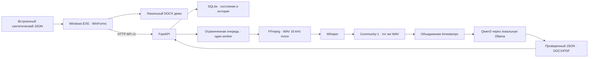

# Архитектура SAMRUK KAZYNA

## Компоненты текущего main

Основной клиент — C# 5 / WinForms, собираемый в один EXE на системном
.NET Framework 4.8+. Streamlit и pywebview/PyInstaller сохранены как предыдущие
эксперименты и не запускаются нативным клиентом.

Связи реализованы в коде. Native API-клиент проверен с настоящими FastAPI, SQLite,
очередью и экспортом; нейросетевые вызовы в этой проверке заменены синтетическими.
Сквозной запуск с реальными моделями ожидается на компьютере Local AI.
Доступность health не подтверждает качество распознавания.

## Границы и ответственность

| Слой | Исходники | Текущее поведение |
| --- | --- | --- |
| Окно и навигация | `desktop/native/MainForm.cs` | Файл, результат, история и подключение; явное демо |
| API-клиент | `desktop/native/ApiClient.cs` | Целевой HTTP v1, валидация ответов, таймауты/отмена |
| Настройки | `desktop/native/Settings.cs` | Origin сервера; локальное сохранение URL |
| Локальный экспорт | `desktop/native/LocalExport.cs` | DOCX из показанного результата и системная печать |
| HTTP API | `backend/app/api/routes.py` | Загрузка, список, состояние, результат, DOCX/PDF и health |
| Очередь и обработка | `backend/app/pipeline.py` | Один worker, последовательные модели, объединение timestamps, анализ частями |
| Хранение | `backend/app/storage.py` | SQLite-метаданные, восстановление прерванных задач; файлы в каталоге встречи |
| Схемы / домен | `backend/app/schemas/`, `backend/app/models/` | Типы результата, реплик и поручений |
| STT | `services/stt/local.py` внутри `backend/app/` | `LocalSTTService`, исходный текст и timestamps |
| Диаризация | `services/diarization/local.py` | `LocalDiarizationService`, интервалы анонимных говорящих |
| Анализ | `services/llm/local.py` | `LocalMeetingAnalysisService`, резюме, поручения и проверка источников |
| Серверный экспорт | `services/export/local.py` | Локальные DOCX/PDF с Unicode-шрифтом и проверкой результата |

Точные имена, параметры конструкторов и ограничения адаптеров приведены в
[Local AI handoff](local-ai/handoff.md). Конструкторы не загружают модели;
загрузка происходит при явной обработке. `Pipeline` использует прямые импорты
локальных адаптеров; сохранённые интерфейсы и placeholders не подменяют реальные вызовы.

`scripts/local-ai/evaluate-meeting.py` объединяет диагностические этапы для
локальной записи/PDF, включая нормализацию и эвристику сопоставления говорящих.
Этот CLI не является серверным orchestrator; его новая версия целиком с моделями
пока не проверена. Диагностическое сравнение с PDF не заменяет эталон STT.

## Реализованный серверный поток

1. EXE передаёт запись backend через multipart `file` и получает ID.
2. Backend проверяет размер/содержимое, сохраняет задание и ставит его в очередь.
3. Запись декодируется; STT получает сегменты, диаризация — интервалы говорящих.
4. Backend сопоставляет интервалы и сегменты по времени.
5. Локальная LLM формирует резюме и поручения с цитатами.
6. Сервер валидирует, хранит результат, создаёт DOCX/PDF.
7. EXE опрашивает состояние, отображает Result и скачивает доступные экспорты.

SQLite, python-docx и ReportLab используются в серверной реализации. При недостаточной
или неоднозначной временной привязке говорящий остаётся `UNRESOLVED`. Длинный текст
анализируется частями по границам реплик, без молчаливого обрезания; резюме частей
помечаются явно. Полностью совпадающие поручения удаляются из повторов.
Результат публикуется после проверки схемы и создания обоих экспортов.
Контракт маршрутов: [api-contract.md](api-contract.md),
запуск на сервере моделей: [backend-launch.md](backend-launch.md).

## Почему такое разделение

- Лёгкий клиент не поставляет многогигабайтные веса и GPU-runtime каждому пользователю.
- Интерфейсы STT, диаризации и LLM позволяют проверять модели отдельно от окна приложения.
- На машине с ограниченной VRAM сервер запускает модели последовательно с освобождением
  памяти между этапами. OS-lock запрещает второму backend использовать то же хранилище.
- Источник поручения связывает вывод LLM с исходной репликой для проверки человеком.
- Анонимная метка говорящего не является подтверждённой личностью. Имя автора
  привязывается только при наличии текстового основания; неоднозначность сохраняется.

Используется последовательный AI-пайплайн. Автономный агент с подключением к
видеовстречам и выполнением действий за пользователя не реализован.

## Размещение и данные

EXE обращается к backend на том же ПК или в LAN. Ollama остаётся на loopback
серверного ПК. Запросы моделей, записи и производные тексты должны оставаться
внутри выбранного контура. Первоначальная установка пакетов/весов выполняется отдельно.
Проверки офлайн-режима описаны с границами в [verification.md](verification.md).

Клиент не открывает ссылки из транскрипта автоматически, проверяет URL и не следует
redirect при загрузке. Эти меры не заменяют аутентификацию и HTTPS: промышленная
эксплуатация, роли доступа, сроки хранения и аудит действий ещё не реализованы.
Настройки retention в `.env.example` пока декларативны, автоудаление записей не работает.

История встреч реализована через SQLite и API. Редактирование поручений из прежнего
Streamlit-стека не перенесено в native-контракт. [Различия интеграций](integration-notes.md).
